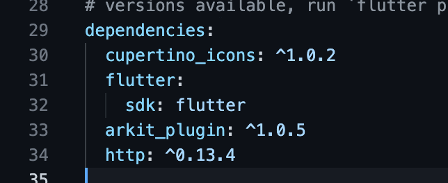
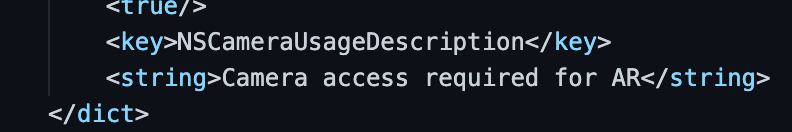
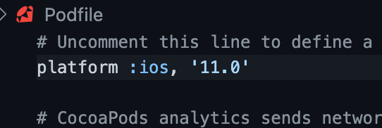
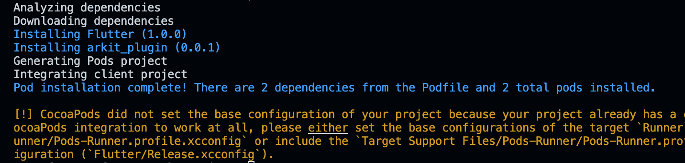
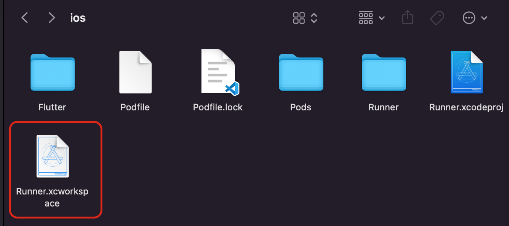
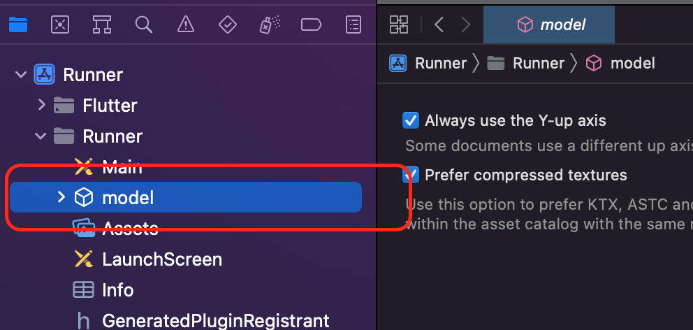
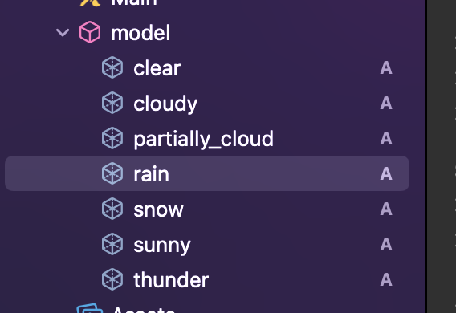

## AR Weather App using ARKIT - Lesson 1

In this lesson we will be importing the required packages, configuring the projects and then importing the models.

### Importing the required Packages
1. Go to **pubspec.yaml** file and add `arkit_plugin: ^1.0.5` and `http: ^0.13.4` package under *dependencies*.

2. Run `flutter pub get` command in your terminal.

### Configuring for iOS
1. Add this line in your **Info.plist** file, which will be under `ios/Runner/Info.plist`.
```
<key>NSCameraUsageDescription</key>
<string>Camera access required for AR</string>
```

2. Open **Podfile** and change the platform version from `9.0` to `11.0`

3. Open terminal and navigate to **ios** directory from the current project and run `pod install`

*No need to worry about warnings*

### Importing the models
1. Open the **Runner.xcworkspace** file in XCode inside the *ios* directory.

2. Create a new folder **models.scnassets** inside **Runner** folder.

3. Now import all the models. The models which are used are modeled using Blender.


