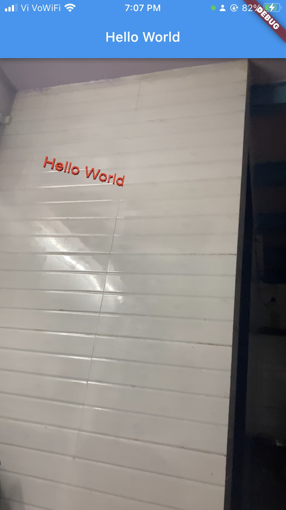
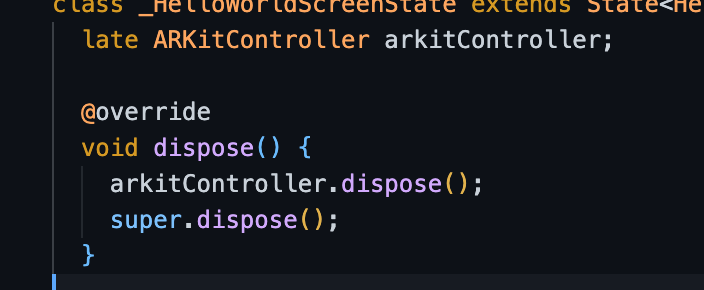

## AR Weather App using ARKIT - Lesson 2

In this lesson we will be creating Hello World using ARView and will be going through some of the basic stuffs of AR App.


#### Creating the Hello World AR App

1. Create a Statefull widget

2. Late Initialize ARKitController and dispose the ARKitController


3. Adding the ARKitSceneView in your Scaffold body.
```dart
@override
  Widget build(BuildContext context) {
    return Scaffold(
      appBar: AppBar(
        title: const Text("Hello World"),
      ),
      body: ARKitSceneView(
        onARKitViewCreated: onARKitViewCreated,
        environmentTexturing:
            ARWorldTrackingConfigurationEnvironmentTexturing.automatic,
      ),
    );
  }
```
**onARKitViewCreated:** This will be called when the ARKitSceneView will get initialized on screen.
**environmentTexturing:** It gathers the environment texture in the scene whiich will be used for lighting the texture in the scene.

4. Initializing ARKitController on ARView created
```dart
  void onARKitViewCreated(ARKitController arkitController) {
    this.arkitController = arkitController;
    this.arkitController.add(_createHelloWorldText());
  }
```

On ARKitView Cretaed we are initializing the arKitController and on ARKit Controller we will be adding the Hello World Text.
So to add that Hello world text we have created a seperate method for that Hello World Text.

5. Creting the Hello World Text in ARKit Scene
```dart
    ARKitNode _createHelloWorldText() {
    final text = ARKitText(
      text: 'Hello World',
      extrusionDepth: 2,
      materials: [
        ARKitMaterial(diffuse: ARKitMaterialProperty.color(Colors.red))
      ],
    );
    return ARKitNode(
      geometry: text,
      position: vector.Vector3(-0.1, 0.1, -0.4),
      scale: vector.Vector3(0.001, 0.001, 0.001),
    );
  }
```
* Based on the previous step, the controller called the **_createHelloWorldText()** function. So on this function we are creating **ARKitText** and passing the required parameter and assigning it to a variable.
* And we need to place the ARKitText on the scene using the ARKitNode. So basically, ARKitNode has multiple parameter we will be using the position and scale parameter for placing and scalling the Text.
* Please feel free to play with all the parameters in ARKitNode.