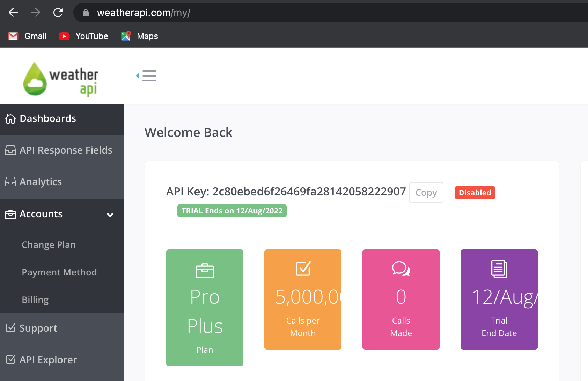

## AR Weather App using ARKIT - Lesson 4

In this lesson we will be doing Weather API Integration in AR Weather App.

#### Weather API Integration Setup
1. Open [Weather API Website](https://www.weatherapi.com/).
2. Create a new Account, if not created before.
3. Once logged in, navigate to [https://www.weatherapi.com/my/](dashboard) and copy your token.



#### API Response Service
1. Create a new folder named **services** and create a file named **weather.dart** and paste below code.
```dart
import 'dart:convert';

import 'package:ar_weather_app/models/weather.dart';
import 'package:http/http.dart';

class WeatherService {
  final baseUrl = "http://api.weatherapi.com/v1";

  // TODO: Place you token below
  final _token = "Your Token goes here";

  Future<CurrentWeather> getCurrentWeather(String search) async {
    final url = "$baseUrl/current.json?key=$_token&q=$search";
    final response = await get(Uri.parse(url));
    final resposeJson = jsonDecode(response.body);
    return CurrentWeather.fromJson(resposeJson);
  }
}

```
2. Paste the Token which you copied in from the [Weather API Dashboard](https://www.weatherapi.com/my/) in your WeatherService class.


#### Creating Models of Weather
1. Create a new folder named **models** inside **lib** folder, and inside create a new file named **weather.dart**.
2. Copy below Weather Model and paste it in your **weather.dart** file inside **models**.
```dart
class CurrentWeather {
  Location? location;
  Current? current;
  Error? error;

  CurrentWeather({this.location, this.current, this.error});

  CurrentWeather.fromJson(Map<String, dynamic> json) {
    location = json['location'] != null
        ? new Location.fromJson(json['location'])
        : null;
    current =
        json['current'] != null ? new Current.fromJson(json['current']) : null;
    error = json['error'] != null ? new Error.fromJson(json['error']) : null;
  }

  Map<String, dynamic> toJson() {
    final Map<String, dynamic> data = new Map<String, dynamic>();
    if (this.location != null) {
      data['location'] = this.location!.toJson();
    }
    if (this.current != null) {
      data['current'] = this.current!.toJson();
    }
    if (this.error != null) {
      data['error'] = this.error!.toJson();
    }
    return data;
  }
}

class Location {
  String? name;
  String? region;
  String? country;
  double? lat;
  double? lon;
  String? tzId;
  double? localtimeEpoch;
  String? localtime;

  Location(
      {this.name,
      this.region,
      this.country,
      this.lat,
      this.lon,
      this.tzId,
      this.localtimeEpoch,
      this.localtime});

  Location.fromJson(Map<String, dynamic> json) {
    name = json['name'];
    region = json['region'];
    country = json['country'];
    lat = double.tryParse("${json['lat']}");
    lon = double.tryParse("${json['lon']}");
    tzId = json['tz_id'];
    localtimeEpoch = double.tryParse("${json['localtime_epoch']}");
    localtime = json['localtime'];
  }

  Map<String, dynamic> toJson() {
    final Map<String, dynamic> data = new Map<String, dynamic>();
    data['name'] = this.name;
    data['region'] = this.region;
    data['country'] = this.country;
    data['lat'] = this.lat;
    data['lon'] = this.lon;
    data['tz_id'] = this.tzId;
    data['localtime_epoch'] = this.localtimeEpoch;
    data['localtime'] = this.localtime;
    return data;
  }
}

class Current {
  double? lastUpdatedEpoch;
  String? lastUpdated;
  double? tempC;
  double? tempF;
  double? isDay;
  Condition? condition;
  double? windMph;
  double? windKph;
  double? windDegree;
  String? windDir;
  double? pressureMb;
  double? pressureIn;
  double? precipMm;
  double? precipIn;
  double? humidity;
  double? cloud;
  double? feelslikeC;
  double? feelslikeF;
  double? visKm;
  double? visMiles;
  double? uv;
  double? gustMph;
  double? gustKph;

  Current(
      {this.lastUpdatedEpoch,
      this.lastUpdated,
      this.tempC,
      this.tempF,
      this.isDay,
      this.condition,
      this.windMph,
      this.windKph,
      this.windDegree,
      this.windDir,
      this.pressureMb,
      this.pressureIn,
      this.precipMm,
      this.precipIn,
      this.humidity,
      this.cloud,
      this.feelslikeC,
      this.feelslikeF,
      this.visKm,
      this.visMiles,
      this.uv,
      this.gustMph,
      this.gustKph});

  Current.fromJson(Map<String, dynamic> json) {
    lastUpdatedEpoch = double.tryParse("${json['last_updated_epoch']}");
    lastUpdated = json['last_updated'];
    tempC = double.tryParse("${json['temp_c']}");
    tempF = double.tryParse("${json['temp_f']}");
    isDay = double.tryParse("${json['is_day']}");
    windMph = double.tryParse("${json['wind_mph']}");
    windKph = double.tryParse("${json['wind_kph']}");
    windDegree = double.tryParse("${json['wind_degree']}");
    windDir = json['wind_dir'];
    pressureMb = double.tryParse("${json['pressure_mb']}");
    pressureIn = double.tryParse("${json['pressure_in']}");
    precipMm = double.tryParse("${json['precip_mm']}");
    precipIn = double.tryParse("${json['precip_in']}");
    humidity = double.tryParse("${json['humidity']}");
    cloud = double.tryParse("${json['cloud']}");
    feelslikeC = double.tryParse("${json['feelslike_c']}");
    feelslikeF = double.tryParse("${json['feelslike_f']}");
    visKm = double.tryParse("${json['vis_km']}");
    visMiles = double.tryParse("${json['vis_miles']}");
    uv = double.tryParse("${json['uv']}");
    gustMph = double.tryParse("${json['gust_mph']}");
    gustKph = double.tryParse("${json['gust_kph']}");
    condition = json['condition'] != null
        ? new Condition.fromJson(json['condition'])
        : null;
  }

  Map<String, dynamic> toJson() {
    final Map<String, dynamic> data = new Map<String, dynamic>();
    data['last_updated_epoch'] = this.lastUpdatedEpoch;
    data['last_updated'] = this.lastUpdated;
    data['temp_c'] = this.tempC;
    data['temp_f'] = this.tempF;
    data['is_day'] = this.isDay;
    if (this.condition != null) {
      data['condition'] = this.condition!.toJson();
    }
    data['wind_mph'] = this.windMph;
    data['wind_kph'] = this.windKph;
    data['wind_degree'] = this.windDegree;
    data['wind_dir'] = this.windDir;
    data['pressure_mb'] = this.pressureMb;
    data['pressure_in'] = this.pressureIn;
    data['precip_mm'] = this.precipMm;
    data['precip_in'] = this.precipIn;
    data['humidity'] = this.humidity;
    data['cloud'] = this.cloud;
    data['feelslike_c'] = this.feelslikeC;
    data['feelslike_f'] = this.feelslikeF;
    data['vis_km'] = this.visKm;
    data['vis_miles'] = this.visMiles;
    data['uv'] = this.uv;
    data['gust_mph'] = this.gustMph;
    data['gust_kph'] = this.gustKph;
    return data;
  }
}

class Condition {
  String? text;
  String? icon;
  double? code;

  Condition({this.text, this.icon, this.code});

  Condition.fromJson(Map<String, dynamic> json) {
    text = json['text'];
    icon = json['icon'];
    code = double.tryParse("${json['code']}");
  }

  Map<String, dynamic> toJson() {
    final Map<String, dynamic> data = new Map<String, dynamic>();
    data['text'] = this.text;
    data['icon'] = this.icon;
    data['code'] = this.code;
    return data;
  }
}

class Error {
  double? code;
  String? message;

  Error({this.code, this.message});

  Error.fromJson(Map<String, dynamic> json) {
    code = double.tryParse("${json['code']}");
    message = json['message'];
  }

  Map<String, dynamic> toJson() {
    final Map<String, dynamic> data = new Map<String, dynamic>();
    data['code'] = this.code;
    data['message'] = this.message;
    return data;
  }
}
```

#### Calling the API from Frontend
1. Declare a variable named currentWeather.
```dart
    CurrentWeather? currentWeather;
```
2. In *TextField*, onEditingComplete replace all the code.
```dart
    currentWeather = await WeatherService()
            .getCurrentWeather(searchController.text);
    if (currentWeather?.error != null) {
        ScaffoldMessenger.of(context).showSnackBar(
            SnackBar(
            backgroundColor: Colors.red,
            content: Text(currentWeather?.error?.message ?? ""),
            ),
        );
    } else {
        isSearchEnabled = false;
    }
    setState(() {});
```
3. In *body* place the current weather global parameter to check the weather.
```dart
    body: Container(
        child: Text(
          "Current Weather: ${currentWeather?.current?.condition?.text}",
        ),
    ),
```

#### Output
